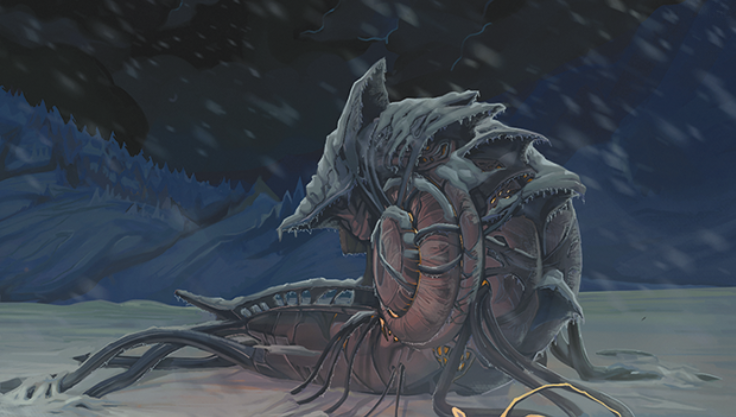

## 42 - 420 the Episode!

## DISCLAIMER

Our session was quickly halted at the start by some major technical issues! More 420 occurred then normal at the start due to this. Information may or may not be correct!

Also! The DM shit himself last week!

## Begin

As we leave Dougan's hole, and hopefully for our last time, we again make our trek south to find the source of Ishamael's headaches. We head that direction for two hours, Ishamael mentions that the headaches started getting better, so we backed up a bit and head Northwest to a nook in the mountain range we were walking past.

Greymond, with his weird glasses, sees some sort of creature or thing with pipes going into it far ahead. Otis finds us a good spot to park our animal gang, Turq takes off his skis and Ishamael jumps into Truqs arms to carry him out, and we make our way to approach this thing that Greymond sees.

We approach the creature/thing cautiously, as we get closer, we can see a much better picture of the creature/thing.

It looks like some sort of living creature and it has a deck like a ship.

Ishamael is looking like the headaches are really hitting him hard but does his best to manage it.Truq lifts him up to see the top of the creatures deck to see some balistas on it.

While Ishamael is scouting the top of the boat, I start wondering around the side of the boat, but I stepped on something squishy, and out of the ground appeared some worm like creature with very angry teeth.

Even though this worm tried a surprise me, it had no effect on me and I saw it coming and immediately attacked and hit the creature. The creature wasn't having any of my shenanigans, cause it gave me a minor bruise, but then poisoned and paralyzed me, then it began dragging me further behind the boat. Then a second creature sprung out of the ground, defending the first creatures retreat.

The remaining ball buster crew began destroying the new creature that arrived and began an operation to get me out of the pickle I got myself into. Ishamael and Otis both used their bag of tricks, summoning a giant elk and a dire wolf. During this, I quickly overcame the paralyzing/poisoning effect that the creature had applied to me which the creature tried to apply again, but I'm not falling for the same trick twice. The creature seeing that it failed to do anything, starts running away from us, we all try to hit it as it runs, but none of us manage to strike it.

The encounter ends when Hirakas deals the killing blow to one of the creatures with his famous beam blasty thing he does and Ishamael sent his new fancy shield guardian to beat the remaining creature to death.

I proceeded to filet one of the creatures dead bodies looking for potential loot in its belly, but nothing was to be found other than a putrid smell.

Truq then proceeds to lift us up one by one onto the deck of this weird creature thing. We see a door that looks a bit like a person butt hole, as I am about to prepare ramming the door with my ram, we notice that as Greymond walks by the door, it looks like the anus door started opening, then closed up again as he moved away.

Noticing this, the crew tells Greymond to move to the door. As he moves closer, the anus starts opening but ice around the anus is stopping it from fully opening. Greymond uses his pick axe to break away the ice and the anus door blast open for us all to see the inside.

We see a bunch of crates and broken equipment but we also see some strange creature that looks like its stitched together by multiple body parts from multiple creatures. Some creatures parts I notice are orcs, dwarves, and reindeer. The creature turns towards us and engages us in combat.

Greymond and I charge in to where the creature is, to my surprise another small creature with a tentacle face pops out from where I am standing, squeals, and move away from us. We proceed to attack the Frankenstein like creature, both of us landing some blows, and Greymond trips the creature to the floor.

The creature that moved away from me, sees Ishamael and starts calling him "Delishmeal, Delishmeal"… I think they wanna eat Ishamael...?

The party began slicing and blasting this Frankenstein like creature, all the while, more of these small creatures would see Ishamael and start calling out to him saying "Delishmeal"

Ishamael cast suggestion on one of the creatures yelling delishmeal, suggest that they end this fight and answer his questions. Another tentacle face creature pops out and says "Delishmeal" and "yum yum," they really do wanna eat Ishamael it seems.

Our crew continues to pound the Frankenstine until I finally kill it by chopping off its head. I quickly move behind one of the tentacle faced creatures, in an intimidating manner, so they don't get any bright ideas to start eating Ishamael. My intimidation works, and the creature calls out for someone named Dredavex.

From the stair case that leads up stairs, comes a much bigger tentacle faced creature, similar to the small ones calling out to Ishamael. Dredavex immediately turns to Ishamael and asks him if they have the psi crystal, which confuses Ishamael and everyone. Ishamael ask what the device in his hand is for, to which Dredavex responds, it’s some sort of tracker. Ishamael askes Otis to take the device from Dredavex.

Otis, being abnormally nice, asked nicely for the tracker device. Dredavex instead keeps asking about a Psi Crystal. Otis whips out his Shardlin dagger asking if that’s what he is looking for, cause we have no clue what Dredavex is talking about, Dredavex responds "no they don't need that"

Otis starts asking about the empty brained dark dwarves, to which Dredavex tells us they eat the brains of lesser beings, even though those ones taste awful. Then mentioned that’s why the need Ishamael, for "flavor"

Ishamael again askes Otis to get the tracker device, Otis grabs the device out of Dredavex's hand and hands it off to Ishamael. Without a second thought, Ishamael drops the device on the floor and Truq steps on it, I guess we will never know what that thing tracks. To Ishamaels dismay, his headaches did not go away.

Ishamael askes Dredavex , what is causing his headaches. Dredavex says it is a signal upstairs, and as Ishamael starts attempting to go upstairs, Dredavex offers to go upstairs for him to turn it off, and he does as he states. Once the signal is turned off, Ishamael's headaches go away.

Dredavex returns from the next floor, again asking about the psi crystals, he needs them for repairs. Ishamael suggest that Dredavex return his memories, Dredavex says they can't do that. Ishamael plays hardball and says, then no psi crystals for you.

Dredavex says they can't do that but very strong magic might be able to restore what is gone. Ishamael ask, What magic? Dredavex says we need a person with great magic skill to cast a restoration skill. Turns out Otis knows older clerics with this knowledge, but he has not learned this yet.

I ask Dredavex , what are you going to do with the psi crystals. He tells us it will power the ship. Otis comments, it's so they can find more brains, and again they confirm they eat lesser beings brains.

Otis and I link up our eyes and start moving to encircle Dreadavex, as he tells us they took Ishamaels brain to add flavor to their lesser being brain stew in the barrels all over the boat. I asked if Ishamael consented to his brain getting added as flavor, he answered they he did not give consent.

Ishamael is about to ask for them to disable the antenna that gave him headaches for ever, but Otis nudges his weapon to Ishamael, Greymond, and I, and we know what must happen, we don't need this guy any more. Surprise mother fucker!

Hirakus attacks one of the smaller tentacle faced creatures and kills it. Another one nearby, runs away to a room, closing the door behinds him.

We and I mostly mean Ishamael, start wailing on Dredavex . The shield guardian bashes away, the giant elk charges and smashes into Dredavex , and lastly Ishamael turns Dredavex into solid ice.

At the top of the stairs, appears a second creature, similar to Dredavex . Says what's going on here and cast a spell, touches himself and teleports away.

We proceed to genocide the remaining smaller tentacle faced creatures. I kill one of them, then move to the anus door where the last one ran away too, taunting them by saying I'm coming for you. Then Greymond moved to the anus door and it opened right up, and he quickly killed the creature inside. Afterwords, Greymond checks out what is inside the other anus doors in this place, not really finding anything worth mentioning, but how is he able to open these doors?

With that, all the creatures were either dead or gone. Ishamael moves up to the next floor, followed closely behind by Truq. I follow Ishamael up, so does the rest of the party. The room looks like some sort of lab, but very alien to us.

We go to the top floor, which looks like the bridge of this ship. Lots of weird jelly fish things are hanging from the ceiling, a fancy chair, and some flesh crystals?

We search this floor to find an observation deck. In another room, we find strange things like lots of wands held in some sort of pincher claw. This was the last floor, and no signs of the larger tentacle face that got away.

Hirakus suggest some ideas to the group, destroy the antenna and destroy the ship, or take over the ship but would need to find out how to drive it and let the doors open for more then just Greymond and Ishamael.

Otis runs downstairs and loots Dreadavax and gets a laser gun. Otis, not knowing what the laser gun was, shoots the laser gun into his hand. Then he comes back to the command deck of the ship and shoots the jelly fish tendrils above the control chair. Gas starts shooting out of where he shot. Greymond tells Otis to knock it off. Ishamael ask if Otis's god gave him that gun, to which he says no he got it off of Dredavex's body.

-Thodurr
