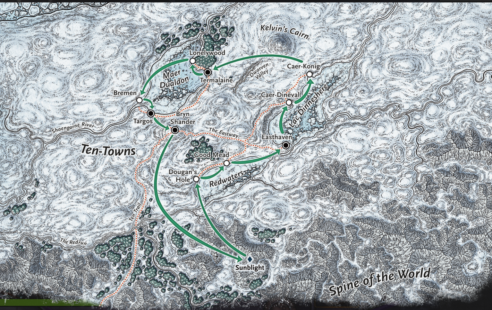

# 43 - Burn Baby Burn

## 📅 11th of Uktar, 4:46pm; inside Id Ascendant, top floor (bridge)

We're on the bridge of some alien ship, and I hate it here. Nothing makes sense. My headaches went away as soon as the contraption was turned off, but I still feel some extrasensory effects that I can't identify. I stare at the things on the wall, trying to decipher them, but without any luck. I know I'm smarter than this. I try giving one of the crystals I found to Thodürr to see if that's what is triggering the doors to open, but that theory turned out false.

⚔ Encounter starts

Devices on the wall (7 feet up) suddenly start shooting at us. The old man dodges the first two shots and runs back into the room.

Hirakas trades places with Ishamael and fires off two Eldritch Blasts, destroying one of them.

He summons a tentacle and destroys the first one he missed.

Otis then moves up and destroys another turret.

Thodürr is up next and obliterates the remaining two in the room.

Encounter ends

Hirakas looks through the material on the table and finds a sticky, metal monocle (Eyes of Minute Seeing) and a slime cap made from a space slug.

Ishamael examines the crimson tube behind the bridge... he seems unusually drawn to it.

We go to the next level down, and again take note of the ballista. 2 members try to figure it out, but can't seem to. I tell them to step aside and immediately understand exactly how this alien ballista works. I then take aim at the wool wolf (with Otis' permission) and fire a perfect shot. I know crossbows, big or small.

Ishamael goes into the other room on this level and investigates a strange metal sphere adorned with small windows. I follow in and compare the crystal inside with my own. They are remarkably similar, except that the one in the ship looks spent and blackened, while mine still glows with a purple hue.

We discuss what to do with the ship. Some are in favor of keeping the ship for utility, greatly increasing our mobility if we can get it working, while others want to destroy it.

Hirakas grabs 20 small crystals (~1 in. cube, Psi) from the ceiling.

We decide to dismantle one of the ballistas from its base so we can take it with us. We also take 100 crossbow bolts from the walls.

We go back down to the first level. Opening the crates, Otis & Hirakas find 3 functional Laser Rifles (30 charges per weapon).

Hirakas tries jamming his hand into a door to try and open it, and after some wiggling, it surprisingly opens.

Ishamael checks the 4 rooms in the back again for anything we missed. Each room has 2 empty pods with a small airway of some sort, but not much else.

Back in the main room, we also open the barrels and see a lumpy pink sludge. I don't know what it is, but I leave it alone.

I check the deceased group in the corner. I pick up 8 gold, and one of them has a map of ten towns. It shows some kind of route marked in a counter-clockwise direction, passing through Sunblight along with every one of the towns.

.44 %-Lonelywood fäå•:. Kelv.ih& C . Z Caer-K&iig.. Bremen' i Ten-Towns Good Mead . Ridwote Sunblight ithe Wokld ine o

Once we were finished, we decide to light the thing on fire. The fire spreads slowly up the ship, taking 30 minutes to reach the top. We spend another hour just watching the ship burn. I felt something coming from the ship as it burned.... but don't know what exactly. It felt like it was... in pain.

We move north and set up camp for the night.

💤 Long Rest

## 📅 12th of Uktar, 9:03am

We prepare in the morning to scout Sunblight. When we passed through a narrow passageway, Ishamael noticed footprints leading away from Sunblight, contradicting the map we just acquired.

If we follow those tracks and try to catch up to them, we could gain some valuable intel. However, the tracks look too old to reasonably catch up to them.

As we approach the place marked as Sunblight on the map, we come across a massive fortress surrounded by low clouds embedded into the Spine of the World. It has a few arrow slits on its otherwise blank surface, and we can hear clanking sounds coming from within. We also see a narrow staircase on the left side of the fortress. The moment we arrive, a beam of energy emits from the top of the fortress, and we suddenly see a gigantic black dragon emerge into the sky, colored in a way that looks very similar to chardalyn. I realize the map we found is not a trade route.

We are faced with a decision: Move further into the Sunblight fortress or try to chase the dragon.

## 📅 12th of Uktar, 2:00pm

- Graymond
