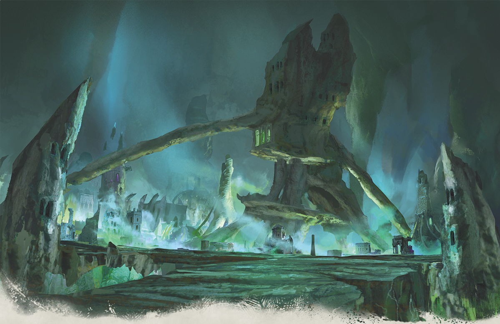

# 68 - The Netherese City

## 📅 25th of Uktar, 9:30pm; Caves of Hunger

I am approximately 9 feet tall and feel stronger than ever.

Thodürr starts rubbing his belly button. I don't ask about the new ritual, but after a few minutes he seems to gain some knowledge about our immediate surroundings. Something about far realms and Teiflings but nothing that concerns me.

Otis also seems to be focusing on some commune of his own, and shares what he could sense from Tempus.

- Is the transdimensional doodad guy the one who made all the cities go upside-down? No
- Do you think we could take it? No
- Should we try to take it? No?

We proceed south and enter a huge room with a large, very alien-looking building at its center, surrounded by what looks like an entire city. It's covered in green and purple lights, and the whole area seems slightly tilted.

Professor Mustache says that this is a Netherese city which fell from the sky –339 Dale Reckoning. He says that inns wouldn't be common, but wine would have been common (upper class society, literally).

I use my goggles to survey the main spire. There is a giant glowing orb at the base of the spire that looks important. Professor Mustache says that it's capable of recharging magic items, and even making this city fly. Unclear why it's currently not flying.

There's also a purple sheen covering the whole spire. The Professor thinks it may be some type of protective spell, which would explain why it's in a better condition than the rest of the city.

Otis and Thodurr ask Vellynne what she's looking for, and she wants something small to take away, preferably knowledge of spells. Ishamael asks about her motivations. Vellynne believes there is no nefarious motivation behind her actions. Her group (brotherhood) has a common purpose but it's mostly every person for themselves.

We walk 500 feet toward the city and at its edge we see a 21-foot tall statue with a giant mouth in the center of its abdomen. The professor says that it is a "tomb tapper", and that they turn to stone when they die.

The Tomb Tappers were created during the fight between Netherese and Phaerimm.

We start walking around the outskirts of the city, investigating any building that looks more interesting than most. The first one we searched turned up nothing useful. The second building had a large gate in the front (which was open), and when we went inside, determined that it was a jail of sorts. The cells appear to be held shut with magic. I try pushing open one of the doors, but it holds in place.

Somewhere deep in the jail is an infirmary, with a table and leather straps that appear to be holding something invisible in place.

Ishamael casts a See Invisibility spell and uncovers a clothed, middle-aged Netherese with black hair strapped to the table. He doesn't seem to have decayed like the rest of the city.

We attempt to make contact with the one strapped to the table. Otis pokes the invisible body; it's stiff but not completely frozen. Ishamael casts Message, but there is no response.

There are handwritten notes scattered around the room. We work on translating some of them and learn that various materials and concoctions were being administered to a subject – possibly the one on the table.

Eventually the Command spell was cast on the subject (in Netherese) to wake him, and to our surprise it works. He becomes visible and starts talking almost right away, asking where he is and what is going on. We allow Professor Mustache to fill him in on the state of the world for the past thousand years.

Apparently he was here for disciplinary reasons, and next thing he knew he woke up in the present time. After some coercion, he admits to assassinating a sage in the city to try and get into the spire. He is looking for interesting things. He sounds like a thief to me. His name is Xerophone.

YOU ARE NOW SUBSCRIBED TO NETHER FACTS:

- The Hall of Weightless Wonder is where the city's elite meditate
- Every wizard was obliged to carve their own wand from the nether oak in the arboretum
- Wonders from across the world were sold at the Bazaar of the Bizarre™

We find an inn at the dildo-shaped building.

## 📅 26th of Uktar, 12:07am; Tower of Abjuration

We go to the nearby tower. On the archway there is a symbol for the school of abjuration. Inside is a small half-circle room with a spiral staircase. Hirakas finds a spell scroll of mage armor. Ishamael also finds the same thing.

At the top of the spiral staircase is some precisely-created artwork showing the Netherese imprisoning their enemies.

We come across a door locked with magic, so I pull out the battering ram and smash it wide open. However, a magical trap suddenly teleports me somewhere else. Either the room is really huge... or I have become the opposite and very, very small. I'm also unable to move, but Ishamael sends me a telepathic message and I'm able to respond with my status and surroundings. The room's color and architecture look the same, so I am probably nearby. After a moment, I think I hear a fight happening. Upset that I'm missing it, I would have kicked all of their asses.

## 📅 26th of Uktar, 12:30am

A few minutes later, the group finally makes it and finds me locked in some kind of display case. But before they can get me out, the anvil in the room apparently started speaking to everyone else, demanding items of power in exchange for information.

Thodürr brings me to the anvil and uses the hammer to break open the sapphire I was trapped in. Almost immediately, I'm back to my larger size.

The anvil orgasms over the wand that Hirakas offered. It offers this secret:

In the ritual to turn on and off the force field:

First, shield thy heart with a wand from the Nether Oak

Otis adds the remaining two sapphires (worth 500gp each) to inventory.
