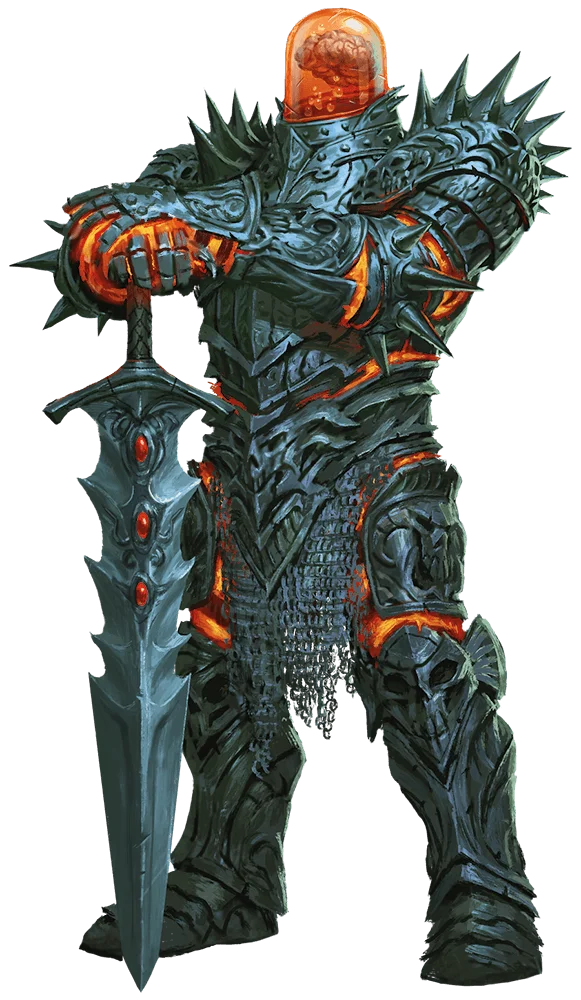

# 81 - Greymond Don't Die!!!

## 📅 28th of Uktar, 02:52

- Begin today in a ball room with a bunch of projection like party goers
- The crew investigates to find that the party goers were mostly illusions but some were undead jars of liquid.
  - Otis tasted the liquid, it was foul and organic.
  - When Greymond asked, they don’t have a reason for the party, just party cause they like it.
- While investigating the party, the whole building starts shaking and all of us except Ishamael stay steady on our feet
  - We hear cackling in the distance, which we assume is Larthas.
  - We also hear loud explosions and structures breaking from the shaking
- The shaking prompts us to move on from the party investigation and to continue finding our way to Aurial Larthas.
- We begin exploring rooms
  - Otis finds a room full of staffs
    - Staff Descriptions:
    - Octopus staff
    - Purple glass, spiral orb
    - Golden luster wood
      - Fish swimming up river
    - Snake on staff
    - Black and jagged staff, this one is magical
    - Otis has Velin test the black staff that is magical, she feels confident when holding it, Otis feels the same.
  - Greymond found a room with an unfinished note written in netherese.
    - Translation says its about some artifact, it is in the stasis chamber for further study
  - Thodurr opened a room to find a lab of some sort with a creature with a giant suit of armor with a head that was just a brain in a large jar with translucent fluid.
    - 
    - The creature tried to ask who I was, I ignore him and instead call for everyone else, figured we should be ready for a fight if it came to it, this creature looks very threatening.
    - After ignoring the creature for longer then I should have, it grabs me by the chest hears, to which I push back with my much superior strength.
    - Now the creature has my attention, it realizes I am just a dwarf with a translator, to which I ask, is being a dwarf a problem? Otis ask if he is racist. Apparently just surprised to see us.
    - I ask its name, their name is: Veneranda
    - Veneranda ask us if we know a way out or if we are unwelcome visitors, but after some negotiation, he invites us into the lab room.
    - Otis asks about why he is a brain in a jar, to which  Veneranda responds his body doesn't exist anymore.
    - Offers the same procedure to us so we can stop being weak, I mentioned I had no problems shoving him off earlier, who is the weak one buddy.
    - Veneranda ask why we are there, and really, just winging it, we came here cause Velin wanted to, that’s about it.
    - We fill Veneranda in about the situation outside with Livistis.
    - Otis, brags about killing the Owl god Aurial.  Veneranda doesn't believe us but we assure him it is true, to which he says we can do the impossible.
    - He mentions that if we can get Aurial Larthas staff of power, Veneranda will join us to go to a northern obelisk that will rewind time to when the city was still flying and everyone is alive
    - What Veneranda didn't know, we had previously pushed over that obelisk, so there is no way his plan will work.
    - We play it off like we didn't know why, but the obelisk broke during the "crash"
    - Veneranda is sad about the info and decides to remain in the room for a few more millennia instead doing anything productive.
    - We tell Veneranda that we are going to go kill Larthas, he seemed happy to hear that.
      - I try to ask for his suit of armor to help us kill Larthas but says that is his body and needs it.
    - Veneranda offers to make us brains in jars like him, Velin peeks up her interest. She wants to think about it.
    - We leave Veneranda and bid him farewell
  - We find one more lounge like room that has a hookah in the middle with party goers around.
  - Otis finds a wine room.
  - Lastly Hirakus opens one more room that initially looks like a black void with a door on the other side.
    - Otis can see a path across the dark void.
      - He shows us he can stand on it and pours flour to illuminate the path for us.
- After going through the void room, we arrive in a room with 11 alcoves with light coming from each alcove.
  - We hear something power up and the lights from the alcoves converge into the middle of the room to form a hologram looking person.
  - Ishamael compliments the light person clothing, which they seem to appreciate
  - Ishamael introduces himself and the light being says they are called Everlast.
  - Similar to the brain jar guy, Everlast ask us why we are here, and Ishamael ask Velin, since she is the reason we did come after all.
  - Everlast tells us it is willing to tell us anything except the restricted info which is restricted to the high wizards or Larthus.
  - Upon hearing that, Otis announces his exit to the room.
  - Shortly after Otis's exit, someone returns wearing Otis's same clothing but wearing the face of High enchanter Ivira still holding Iviras staff. Shapeshifter magic!
  - Otis/Ivira introduces herself as Ivira. She tells Everlast that she gave Hirakus the gem he is wearing and that they are all honorary high wizards
  - After some convincing, (which Curtis did terribly at I must note!) Everlast believe Otis/Ivira.
  - Otis/Ivira ask about any loot we missed.
    - Mentioned an Abracadabra's on this floor
    - Also a spindle that was retrieved from under the sea of moving ice.
  - Otis/Ivira ask about the black staff, it provides immunity to poison and something else.
  - Then asks if Larthas has any weaknesses, or a way to fix them. Everlast didn't have that knowledge
    - Tells us the high wizard is just a floating skull with no body.
  - Ishamael ask one last question about the Mitholar and how to use it.
    - Mentions needing to attune with it but last time someone tried, Larthas knew.
    - If you attune, you can perform magic.
- Ishamael opens a hatch in the ceiling using his mage hand.
  - The hatch opens up to a large shaft with no stairs, might be 80 ft.
  - We come up with a plan to get up the shaft, Ishamael ends up turning his Golem into a bird using polymorph
    - Quick note. Otis is no longer allowed to be polymorphed like he previously was able to, his species is banned cause the DM is racist.
  - The shield guardian grabs us one by one and flies us up the shaft.
- At the top of the shaft we arrive in a new chamber which has a shield around the exit to the shaft we just came out of. On the other side of the shield, there was a small buildup of ice.
  - A glowing crystal is embedded in the arch way of the doorway to the room we are in.
  - After investigating the shield, Ishamael decides to use mage hand to grab the glowing green crystal.
  - When the crystal is removed, the shield falls and the ice falls down on us.
  - Greymond takes a step into the room and begin combat with what looks like force swords.
    - We very quickly take down one of the force swords
    - The other force sword almost took out Greymond with a massive blow, he was looking very bloody.
    - Greymond, angered by the attack, shreds the final force sword, we see the light flash out of the sword.
  - Otis heals Greymond almost back to full.

-Thodurr
