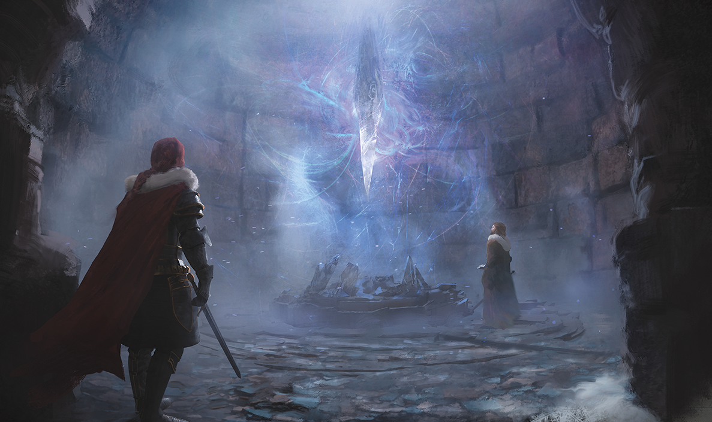

# 82 - 8 Doors, 1 Room

## 📅 28th of Uktar, 4:12am; Spire of Iriolarthas

We open the south door into a hallway with 8 doors, each showing a different symbol above it. Hirakas steps through first and is immediately restrained by some magical force. Otis takes a rope and fishes Hirakas back into the room. Hirakas seems to be turning into stone, but Otis acts quickly and casts Greater Restoration to bring him back to his scaly self.

The floor seems to cause petrification. We throw in a weasel to see what happens, but it's fine. Maybe it's just lucky?

When the date hits midnight on the 29th, Otis' owl comes back.

After looking at the problem with Detect Magic, the trap only extends 10 feet past the doorway. We decide to have one person jump the gap (Otis does this) and have a rope held between him and the shield guardian. Most of the party crosses this way; I grab the weasels and jump instead.

Otis walks to the second door from the right (enchantment symbol) and speaks the name Ivira. The door opens and he steps inside. Hirakas and I follow. The room is completely black for a few feet, but opens up back to regular light. This room has 8 chairs on the far end and a strange starry volumetric effect hanging in the middle of the room. Everyone except for Ishamael uses the same door, while he chooses the door for necromancy instead for some reason. There are now 3 weasels, I thought we had just two. A number of corridors branch off from this room.

Vellynne gravitates toward what looks like a library and spends 10 minutes looking around. We find a Scroll of the Comet and a Adamantium Key.

One of the books suggests that something may happen when at least 3 of the leaders are seated correctly in the previous room.

Meanwhile, Ishamael looks around on the opposite side and finds a large, hovering greyish crystal slowly rotating in the middle of the room.

This is possibly some recovered artifact. Ishamael is very interested and puts a hand up to try and touch the wispy bits. He thinks it might be negatively impacting magic use. He tests this with a Mage Hand, and sure enough, it disintegrates over the course of a few seconds upon contact with the magic wisps. Otis throws the fox into the crystal, but it has a different effect: it just hits the crystal, falls to the ground and runs away.

Hirakas unlocks the door to the south. This just leads to a small overlook where we can see several light sources at the base of the spire.

A cackle emits from outside, and some screams are heard.

Vellynne exits and re-enters the room from a different door, thereby fulfilling the 3-person threshold, but nothing happened.

## 📅 28th of Uktar, 5:30

- The flying sword lasts for a day.

People start drinking from the goblet and playing musical chairs to try and find the right combination. Eventually a portal appears in the middle of the room, under the starry expanse.

We all jump in, YOLO.

We arrive in a large chamber which looks like it hasn't been touched in centuries. A circular, sunken library sits in the middle of the room. 3 one-eyed creatures and a floating skull occupy the room, and all turn to look at us.

## 📅 28th of Uktar, 4:58

- Graymond
